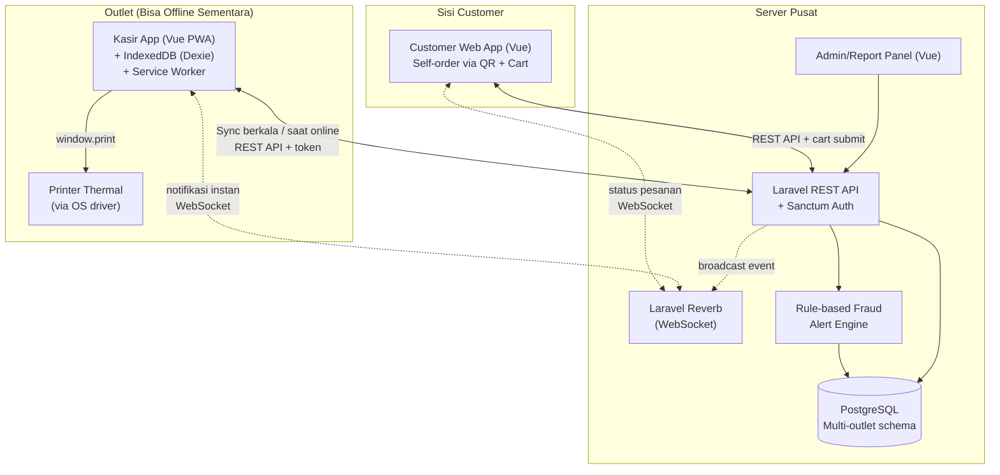
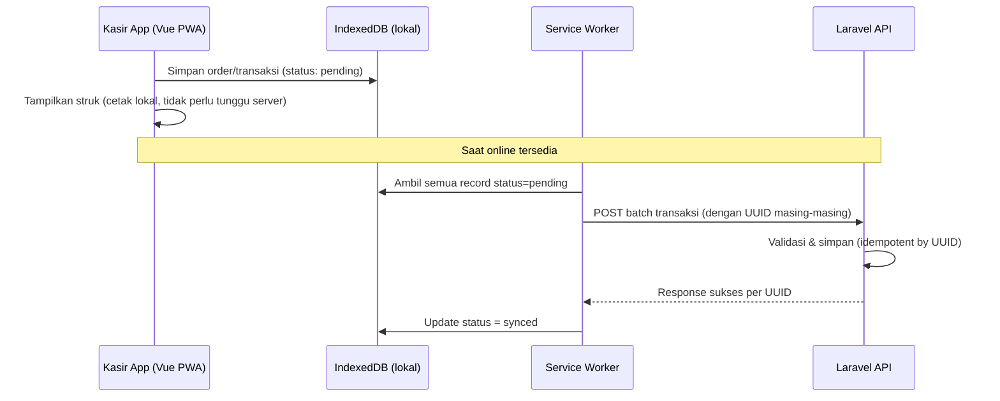
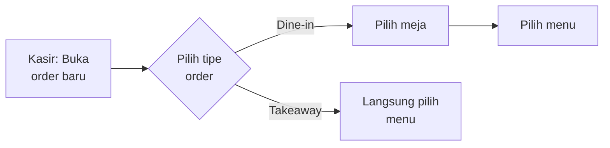
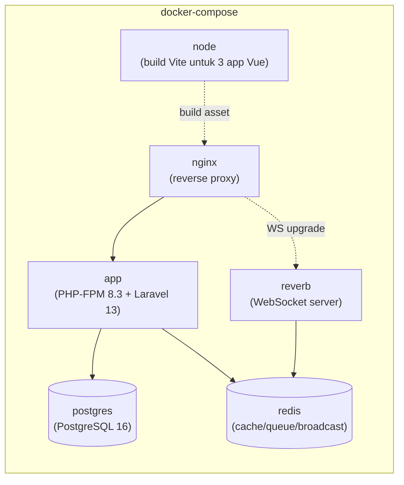

# System Design Document (SDD)
## Sistem POS F&B — iRestora POS

| | |
|---|---|
| **Versi** | 1.0 |
| **Tanggal** | 18 Agustus 2026 |
| **Status** | Draft — Tahap Planning |
| **Dokumen terkait** | `01-PRD.md`, `03-ERD.md`, `04-openapi.yaml` |

---

## 1. Tech Stack

| Layer | Teknologi | Catatan |
|---|---|---|
| Backend / API | **Laravel 13** (PHP 8.3+) | REST API terpusat, API-only (bukan Blade/Inertia). Laravel 13 rilis Maret 2026, minimum PHP 8.3 |
| Auth | **Laravel Sanctum** | Token-based, dipakai semua client (kasir, customer, admin) |
| Database | **PostgreSQL 16+** | Skema multi-outlet-ready; Laravel 13 punya dukungan native untuk connection pooler (PgBouncer/RDS Proxy) via `pooled => true` |
| Dokumentasi API | **L5-Swagger (OpenAPI 3.0)** | Auto-generate dari anotasi controller |
| Frontend Kasir | **Vue 3** + **Vite**, dibangun sebagai **PWA** | Offline-first, wajib di MVP |
| Local Storage Kasir | **IndexedDB** (via **Dexie.js**) | Pengganti SQLite untuk web |
| Service Worker | **Workbox** | Caching asset + background sync |
| Frontend Customer | **Vue 3** + **Vite** (web biasa, tidak wajib offline) | Self-order via QR |
| Frontend Admin | **Vue 3** + **Vite** (web biasa) | Dashboard, laporan, master data |
| Cetak Struk | HTML + CSS `@media print` → `window.print()` | Soft-copy preview dulu, opsional generate PDF (dompdf) untuk arsip |
| Queue/Job (opsional fase 2) | Laravel Queue (Redis) | Untuk proses alert/report berat di background |
| Real-time Notification | **Laravel Reverb** + **Laravel Echo** | WebSocket untuk notifikasi cart customer ke kasir — lihat §4.6 |
| Containerization | **Docker + Docker Compose** | Konsistensi environment dev/staging/production — lihat §10 |

---

## 2. Arsitektur Sistem — Gambaran Umum



**Prinsip kunci:** Kasir App adalah aplikasi **offline-first** — semua aksi (buka order, tambah item, checkout) diproses dan disimpan **lokal terlebih dahulu**, baru dikirim ke server. Server bukan penghambat operasional harian, melainkan pusat agregasi & pelaporan. WebSocket (Reverb) hanya lapisan **kecepatan notifikasi** saat online — REST API tetap sumber kebenaran final, lihat §4.6.

---

## 3. Komponen Sistem

### 3.1 Kasir App (Cashier PWA)
- Dibangun sebagai Single Page Application (Vue 3), di-deploy sebagai PWA agar bisa "diinstal" di tablet/PC outlet dan berjalan seperti aplikasi native.
- **Service Worker** (Workbox) meng-cache seluruh asset aplikasi (JS/CSS) agar app tetap bisa dibuka meski tanpa internet sama sekali.
- **IndexedDB (Dexie.js)** menyimpan:
  - Salinan lokal master data (menu, harga, meja) — di-refresh saat online
  - Transaksi yang dibuat saat offline (status: `pending_sync`)
  - Antrian aksi sensitif (void, diskon) untuk validasi ulang saat sync
- **Background Sync**: begitu koneksi terdeteksi kembali, service worker/JS logic mengirim data pending ke API secara berurutan (FIFO berdasarkan timestamp lokal).

### 3.2 Customer App
- Web app biasa (tidak wajib offline — asumsi customer mengakses saat berada di outlet dengan wifi tersedia).
- Akses via QR code unik per meja → langsung ke halaman menu outlet & meja terkait.
- Order dari customer masuk sebagai status `pending_confirmation`, dikonfirmasi oleh kasir sebelum lanjut ke dapur (mencegah order spam/salah kirim).

### 3.3 Admin/Report Panel
- Online-only, dashboard untuk owner/manager.
- Menampilkan laporan penjualan, kelola master data, dan **dashboard fraud alert**.

### 3.4 Laravel API (Backend Pusat)
- API-only, tidak render HTML apa pun (kecuali endpoint generate PDF struk jika dibutuhkan).
- Autentikasi via Sanctum token untuk semua jenis client.
- Middleware `outlet_scope` — otomatis membatasi query sesuai `outlet_id` user yang login (kecuali role admin pusat).

---

## 4. Strategi Offline & Sinkronisasi (Detail)

Ini adalah bagian paling kritis dari sistem — dijabarkan terpisah karena jadi requirement wajib MVP.

### 4.1 Prinsip Data
- Setiap transaksi dibuat dengan **UUID** (bukan auto-increment) di sisi client, sehingga aman digabung ke server tanpa risiko collision ID antar device/outlet.
- Setiap record transaksi punya kolom: `client_generated_id (UUID)`, `device_id`, `created_at_client`, `synced_at`, `sync_status` (`pending` / `synced` / `conflict`).

### 4.2 Alur Sinkronisasi



### 4.3 Penanganan Konflik
- Server bersifat **idempotent**: jika UUID yang sama dikirim dua kali (misal retry sync), server mengabaikan duplikat, bukan membuat data ganda.
- Konflik data master (misal harga menu berubah saat kasir offline) diselesaikan dengan **prioritas ke transaksi**: harga yang dipakai adalah harga yang tersimpan di device saat transaksi dibuat (snapshot), bukan harga terbaru di server — demi konsistensi struk yang sudah dicetak ke customer.
- Kasir mendapat notifikasi visual jika ada data yang gagal sync setelah beberapa kali percobaan (butuh intervensi manual/manager).

### 4.4 Perhitungan Pajak (PBJT/PB1) & Service Charge

Detail formula dan aturan pembulatan lengkap ada di `03-ERD.md` §4. Poin arsitektur pentingnya:

- Logic perhitungan (subtotal → diskon → service charge → PB1 → pembulatan) **wajib** diimplementasikan sebagai satu service/class tunggal (misal `App\Services\OrderCalculator`), bukan ditulis ulang di beberapa tempat.
- Service yang sama ini dipakai baik oleh:
  - **Kasir App (client, saat offline)** — di-porting/di-replikasi ke JavaScript agar kasir bisa lihat total yang benar tanpa koneksi ke server.
  - **Laravel API (saat sync/validasi)** — untuk memvalidasi ulang perhitungan yang dikirim dari client, mencegah manipulasi total dari sisi client sebelum data masuk ke database.
- Jika hasil hitung client vs server berbeda (indikasi manipulasi atau bug), transaksi ditandai `sync_status = conflict` dan masuk antrian review manual — **bukan** otomatis diterima dengan nilai dari client.
- `pb1_rate` dan `service_charge_rate` diambil dari data outlet (bukan hardcode), sehingga bisa berbeda per daerah/kebijakan Pemda setempat.

### 4.5 Master Data Offline
- Menu, harga, kategori, meja di-cache ke IndexedDB dan di-refresh setiap kasir app dibuka dalam keadaan online.
- Kasir tetap bisa transaksi dengan data master versi terakhir yang tersimpan meski sedang offline berkepanjangan.

### 4.6 Notifikasi Real-Time (Cart Customer → Kasir)

Saat customer submit cart (lihat `03-ERD.md` §5 poin 5, tabel `order_batches`), kasir perlu tahu **secara instan** ada pesanan baru yang perlu dikonfirmasi — bukan menunggu refresh manual.

**Teknologi:** **Laravel Reverb** (WebSocket server resmi Laravel, Redis-backed) + **Laravel Echo** di sisi Vue. Dipilih dibanding polling murni karena latency instan dan beban server lebih ringan untuk banyak kasir/outlet yang terhubung bersamaan; dipilih dibanding SSE karena integrasinya lebih matang dan native di ekosistem Laravel.

**Alur:**
1. Customer submit cart → API menyimpan `order_batches` baru → broadcast event `OrderBatchSubmitted` ke channel privat `outlet.{outlet_id}.cashier`.
2. Kasir app (yang sudah subscribe channel tersebut via Sanctum-authenticated private channel) menerima notifikasi instan, menampilkan badge/alert "pesanan baru dari Meja X".
3. Kasir confirm/reject batch lewat endpoint REST biasa (`POST /api/order-batches/{id}/confirm`).
4. Server broadcast balik event `OrderBatchStatusChanged` ke **channel publik** `table.{qr_code_token}` agar Customer App tahu status pesanannya (tidak perlu autentikasi, datanya tidak sensitif).

**Kaitan penting dengan arsitektur offline-first:** WebSocket **tidak boleh jadi satu-satunya sumber kebenaran** untuk kasir app yang offline-first. Saat koneksi kasir terputus, koneksi Reverb ikut terputus dan notifikasi bisa terlewat. Karena itu:
- Kasir app wajib mendengarkan event `disconnected`/`connected` dari Echo.
- Setiap kali status berubah dari disconnected → connected, kasir app **wajib fetch ulang** daftar `order_batches` berstatus `pending_confirmation` via REST (bukan mengandalkan WebSocket mengejar ketertinggalan) — ini mekanisme rekonsiliasi, konsisten dengan prinsip sync-saat-online yang sama dipakai untuk transaksi offline di §4.2–4.3.
- Reverb hanya untuk **kecepatan** notifikasi saat online normal; REST tetap jadi **sumber kebenaran** yang final.

---

### 4.7 Order Type (Dine-in / Takeaway) & Penentuan Shift untuk Self-Order

### 4.7.1 Alur Kasir: Pilih Order Type Sebelum Meja/Menu

Saat kasir membuka order baru, urutan wajibnya:



- **Dine-in** → wajib pilih meja terlebih dahulu (`table_id` wajib diisi), baru lanjut ke pilih menu. **Hanya meja berstatus `available` yang bisa dipilih** — meja `occupied`/`reserved` tidak muncul sebagai opsi valid (divalidasi di request, dan dicek ulang dengan row-lock di dalam transaksi database untuk mencegah dua kasir mendapat meja yang sama secara bersamaan).
- **Takeaway** → langsung ke pilih menu, **tanpa** langkah pilih meja (`table_id` tetap `null`).
- Validasi konsistensi `order_type` ↔ `table_id` diterapkan **di dua lapis**: FormRequest Laravel (respons error jelas ke UI) dan CHECK constraint PostgreSQL (jaring pengaman terakhir, lihat `03-ERD.md` catatan #6).
- Begitu order dine-in dibuka (baik dari kasir maupun dari customer self-order), status meja otomatis berubah `available` → `occupied`, dan `tables.current_order_id` diisi dengan order tersebut.

**Menutup meja (manual oleh kasir):**
- Meja **tidak otomatis** kembali `available` setelah order dibayar — kasir harus menekan tombol **"Tutup Meja"** secara eksplisit (`POST /api/tables/{tableId}/close`). Alasan pemilihan manual dibanding otomatis: memberi jeda waktu antara pembayaran selesai dan meja benar-benar siap dipakai lagi (misal masih perlu dibersihkan).
- **Syarat:** hanya bisa ditutup jika order yang sedang menempati meja (`current_order_id`) sudah berstatus `paid`. Order yang masih `open` tidak bisa memicu penutupan meja — kasir akan menerima error jelas.
- **Siapa yang boleh:** kasir **manapun** yang sedang memiliki shift aktif di outlet tersebut — tidak harus kasir yang sama yang membuka order di meja itu (mendukung pergantian shift/kasir di tengah operasional).
- **Audit:** setiap penutupan meja tercatat di `audit_logs` dengan `action = close_table`, termasuk snapshot before/after dan siapa yang melakukannya — konsisten dengan aksi sensitif lain (§5.1).
- **Catatan cakupan:** aturan saat ini murni "order harus `paid`". Order yang di-void/cancelled belum punya jalur untuk melepas meja — ini area yang perlu didiskusikan lebih lanjut kalau skenario tsb muncul di operasional nyata.

### 4.7.2 Penentuan Shift & Kasir untuk Order dari Customer Self-Order

Order dari customer self-order (via QR meja) selalu bertipe `dine_in` (karena terikat ke meja tertentu), tapi berbeda dari order yang dibuat kasir — pada self-order, sistem **tidak tahu** siapa kasir yang menangani dan shift mana yang berlaku, sehingga perlu ditentukan otomatis saat cart di-submit:

1. Cari shift aktif outlet tersebut: `Shift::where('outlet_id', $outletId)->whereNull('closed_at')->latest('opened_at')->first()`.
2. **Jika ditemukan** → `order.shift_id` = shift tsb, `order.cashier_id` = `shift.opened_by`.
3. **Jika tidak ditemukan** (outlet belum ada kasir yang buka shift) → request **ditolak** dengan HTTP 409, Customer App menampilkan pesan "Outlet belum menerima pesanan saat ini, silakan hubungi staff" — **order tidak dibuat sama sekali**, bukan dibuat menggantung tanpa shift.

**Alasan memilih "tolak di awal" dibanding "buat dulu, assign shift belakangan":** setiap order tetap konsisten terhubung ke shift sejak awal, sehingga rekonsiliasi kas di akhir shift (§5 audit) selalu akurat tanpa perlu logic tambahan untuk order yang "menggantung" tanpa pemilik shift. Trade-off-nya: ada celah singkat di mana customer belum bisa self-order kalau kasir belum standby — tapi ini mencerminkan kondisi operasional yang memang benar (outlet belum siap layani pesanan).

---

## 5. Desain Keamanan & Kontrol Fraud

### 5.1 Audit Log
- Tabel `audit_logs` terpisah dari tabel transaksi, bersifat **append-only** (tidak ada endpoint update/delete).
- Dicatat otomatis lewat **Laravel Model Observer** pada aksi sensitif (void, diskon, ubah harga, refund, buka laci, login).
- Struktur mengikuti skema di `03-ERD.md`.

### 5.2 Rule-Based Fraud Alert Engine
- Dijalankan sebagai **scheduled job** (Laravel Task Scheduling), berjalan berkala (misal tiap 1 jam / saat shift ditutup).
- Aturan awal (dapat dikonfigurasi via Admin Panel di fase berikutnya):

| Rule | Kondisi Trigger |
|---|---|
| High void rate | Jumlah void per kasir per shift > threshold (misal 5% dari total transaksi) |
| High discount | Total nominal diskon manual per kasir per shift > threshold |
| Cash mismatch | Selisih kas fisik vs sistem saat tutup shift > toleransi (misal Rp 20.000) |
| Sequence gap | Nomor urut transaksi outlet tidak berurutan tanpa alasan (misal void tanpa log) |

- Hasil rule yang terpicu disimpan ke tabel `fraud_alerts`, ditampilkan di dashboard Admin dengan status `open` / `reviewed` / `dismissed`.

### 5.3 Kontrol Akses
- Role-based permission granular (bukan sekadar admin/kasir) — didetailkan di `03-ERD.md` (`roles`, `permissions`).
- Aksi sensitif (void setelah bayar, diskon di atas batas) wajib approval PIN dari role lebih tinggi.
- Perubahan harga menu **hanya** bisa dilakukan lewat Admin Panel, tidak ada endpoint API yang expose kemampuan itu ke role kasir.

---

## 6. Desain Cetak Struk & Kitchen Order

1. Setelah transaksi selesai (baik online maupun offline), Vue app me-render **komponen struk** (HTML) dari data transaksi lokal — ini soft-copy yang bisa dilihat kasir sebelum cetak.
2. CSS `@media print` mengatur ukuran kertas struk (58mm/80mm).
3. Kasir klik "Cetak" → `window.print()` → dikirim ke printer thermal yang terpasang sebagai printer default OS.
4. Kitchen order dicetak dengan pola sama, dikelompokkan per station jika ada multi-printer dapur (fase berikutnya).
5. **Opsional (fase 2):** generate PDF di backend (dompdf) untuk arsip/kirim ke email/WhatsApp customer.

---

## 7. Deployment (Gambaran Awal)

- **Backend Laravel**: dijalankan sebagai container Docker (lihat §10), di-deploy ke VPS/cloud (DigitalOcean, AWS, dsb) atau platform container (misal Railway, Laravel Forge dengan Docker support).
- **Database**: PostgreSQL, idealnya managed service (misal AWS RDS/DigitalOcean Managed Postgres) untuk production, dengan backup harian otomatis. Untuk development, jalan sebagai container Postgres lokal.
- **Frontend (Vue apps)**: build static, di-serve lewat Nginx (bisa satu container yang sama dengan API atau container terpisah), atau static hosting seperti Netlify/Vercel khusus untuk customer app.
- **HTTPS wajib** di semua endpoint (PWA mengharuskan HTTPS untuk Service Worker berfungsi, kecuali di localhost saat development).

---

## 8. Pertimbangan Skalabilitas

- Skema data sudah `outlet_id`-aware sejak awal (lihat `03-ERD.md`) — menambah outlet baru tidak butuh migrasi struktural.
- Tabel transaksi tinggi-volume (`orders`, `order_items`, `audit_logs`) sebaiknya diberi index pada `outlet_id`, `created_at`, dan `sync_status` sejak awal.
- Untuk laporan yang berat (rekap bulanan multi-outlet), pertimbangkan tabel summary/materialized (`daily_sales_summary`) agar tidak query langsung ke tabel transaksi mentah saat data sudah besar.

---

## 9. Risiko Teknis & Mitigasi

| Risiko | Mitigasi |
|---|---|
| Service Worker/IndexedDB browser compatibility berbeda-beda | Uji di browser & device target (Chrome/Edge Android tablet) sejak awal fase development |
| Sync gagal berkepanjangan (device rusak sebelum sempat sync) | Opsi export manual data lokal + rekonsiliasi manual sebagai fallback |
| Printer thermal tidak konsisten via `window.print()` di semua device | Sediakan mode fallback: preview PDF yang bisa di-print manual |
| Rule-based alert menghasilkan banyak false positive di awal | Threshold dibuat configurable, tinjau ulang berdasarkan data riil beberapa minggu pertama |

---

## 10. Containerization (Docker)

Sistem ini **bisa dan disarankan** dijalankan dengan Docker — konsisten di semua tahap (development, staging, production), dan memudahkan onboarding developer baru (`docker compose up` tanpa perlu setup PHP/Postgres/Node manual di tiap laptop).

### 10.1 Struktur Container



| Service | Image dasar | Fungsi |
|---|---|---|
| `app` | `php:8.3-fpm` | Menjalankan Laravel API |
| `nginx` | `nginx:alpine` | Reverse proxy ke `app` & `reverb`, serve static build Vue |
| `reverb` | sama image dengan `app` | WebSocket server (`php artisan reverb:start`) — lihat §4.6 |
| `postgres` | `postgres:16-alpine` | Database utama |
| `redis` | `redis:alpine` | Cache, queue, **dan backend broadcasting Reverb** |
| `node` | `node:20-alpine` | Build-time saja, untuk compile Vue/Vite (tidak perlu jalan terus di production) |

### 10.2 Contoh `docker-compose.yml` (Development)

```yaml
services:
  app:
    build:
      context: .
      dockerfile: Dockerfile
    volumes:
      - ./:/var/www/html
    environment:
      DB_CONNECTION: pgsql
      DB_HOST: postgres
      DB_PORT: 5432
      DB_DATABASE: pos_db
      DB_USERNAME: pos_user
      DB_PASSWORD: secret
      BROADCAST_CONNECTION: reverb
      REVERB_HOST: reverb
      REVERB_PORT: 8080
    depends_on:
      - postgres
      - redis

  reverb:
    build:
      context: .
      dockerfile: Dockerfile
    command: php artisan reverb:start --host=0.0.0.0 --port=8080
    environment:
      DB_CONNECTION: pgsql
      DB_HOST: postgres
      REDIS_HOST: redis
    depends_on:
      - redis
      - postgres

  nginx:
    image: nginx:alpine
    ports:
      - "8000:80"
    volumes:
      - ./:/var/www/html
      - ./docker/nginx.conf:/etc/nginx/conf.d/default.conf
    depends_on:
      - app
      - reverb

  postgres:
    image: postgres:16-alpine
    environment:
      POSTGRES_DB: pos_db
      POSTGRES_USER: pos_user
      POSTGRES_PASSWORD: secret
    volumes:
      - pgdata:/var/lib/postgresql/data
    ports:
      - "5432:5432"

  redis:
    image: redis:alpine

volumes:
  pgdata:
```

### 10.3 Catatan Penting

- **Alternatif lebih ringkas**: Laravel punya **Laravel Sail** (wrapper resmi Docker Compose bawaan Laravel), bisa jadi starting point lebih cepat daripada menulis `docker-compose.yml` dari nol — cocok untuk mempercepat setup awal development.
- **PostgreSQL connection pooling di production**: manfaatkan fitur native Laravel 13 (`pooled => true` di `config/database.php`) jika production nanti pakai managed Postgres dengan pooler (PgBouncer/RDS Proxy/Neon) — mengurangi beban koneksi database saat traffic tinggi dari banyak outlet.
- **3 aplikasi Vue (kasir/customer/admin)** tidak perlu masing-masing container terpisah saat production — cukup di-build jadi static files lalu di-serve oleh Nginx, hemat resource dibanding menjalankan Node server terus-menerus.
- **Volume untuk PWA**: pastikan Service Worker & asset PWA ikut ter-build dan ter-serve dengan header caching yang benar dari Nginx, bukan cuma dari `app` container.
- **Container `reverb` terpisah dari `app`** — meski pakai image yang sama, Reverb butuh proses long-running (`php artisan reverb:start`) yang berbeda siklus hidupnya dari PHP-FPM biasa. Nginx perlu dikonfigurasi meneruskan WebSocket upgrade request (`Upgrade`/`Connection` header) ke `reverb`, bukan ke `app`.
