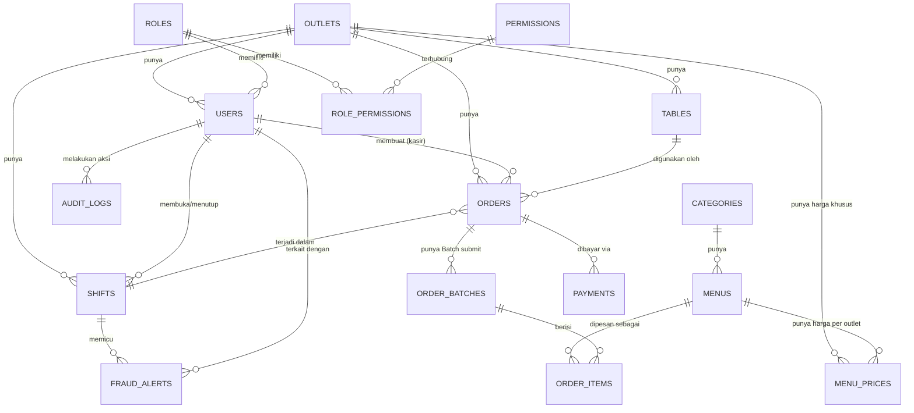

# Database Schema / Entity Relationship Document (ERD)

## Sistem POS F&B — iRestora POS

|             |                        |
| ----------- | ---------------------- |
| **Versi**   | 1.0                    |
| **Tanggal** | 18 Agustus 2026        |
| **Status**  | Draft — Tahap Planning |

Skema ini dirancang **multi-outlet-ready** sejak awal (lihat `01-PRD.md` §2), dengan kolom `outlet_id` di hampir semua tabel operasional, meski MVP dioperasikan untuk satu atau sedikit outlet.

---

## 1. Diagram Relasi (Gambaran Utama)



---

## 2. Detail Tabel

### 2.1 `outlets`

Fondasi multi-outlet — semua tabel operasional mereferensi tabel ini.

| Kolom                   | Tipe              | Keterangan                                                                                                                                         |
| ----------------------- | ----------------- | -------------------------------------------------------------------------------------------------------------------------------------------------- |
| id                      | uuid, PK          |                                                                                                                                                    |
| name                    | string            |                                                                                                                                                    |
| code                    | string, unique    | Kode singkat outlet (misal `JKT01`)                                                                                                                |
| address                 | text              |                                                                                                                                                    |
| pb1_rate                | decimal           | Tarif PBJT/PB1 (pajak restoran) dalam %, **configurable per outlet** karena tarif diatur per Perda daerah masing-masing (maks 10% secara nasional) |
| service_charge_rate     | decimal, nullable | Tarif service charge dalam %, jika berlaku                                                                                                         |
| rounding_enabled        | boolean           | Aktifkan pembulatan grand total ke Rp 100 terdekat                                                                                                 |
| is_active               | boolean           |                                                                                                                                                    |
| created_at / updated_at | timestamp         |                                                                                                                                                    |

### 2.2 `roles` & `permissions`

Role-based access granular (bukan sekadar admin/kasir).

**`roles`**

| Kolom     | Tipe               | Keterangan                                       |
| --------- | ------------------ | ------------------------------------------------ |
| id        | uuid, PK           |                                                  |
| name      | string             | `cashier`, `supervisor`, `manager`, `admin`, dst |
| outlet_id | uuid, FK, nullable | null = role global (misal admin pusat)           |

**`permissions`**

| Kolom | Tipe           | Keterangan                                                                          |
| ----- | -------------- | ----------------------------------------------------------------------------------- |
| id    | uuid, PK       |                                                                                     |
| code  | string, unique | `void.own`, `void.approve`, `discount.apply`, `discount.approve`, `price.edit`, dst |

**`role_permissions`** (pivot)

| Kolom         | Tipe     |
| ------------- | -------- |
| role_id       | uuid, FK |
| permission_id | uuid, FK |

### 2.3 `users`

| Kolom                   | Tipe                | Keterangan                                        |
| ----------------------- | ------------------- | ------------------------------------------------- |
| id                      | uuid, PK            |                                                   |
| outlet_id               | uuid, FK, nullable  | null untuk admin pusat (akses semua outlet)       |
| role_id                 | uuid, FK            |                                                   |
| email                   | string, unique      |                                                   |
| password                | string (hashed)     |                                                   |
| full_name               | string              |                                                   |
| phone                   | string              |                                                   |
| pin                     | string (hashed)     | PIN 4-6 digit untuk approval cepat di layar kasir |
| is_active               | boolean             |                                                   |
| last_login_at           | timestamp, nullable |                                                   |
| created_at / updated_at | timestamp           |                                                   |

### 2.4 `categories` & `menus`

**`categories`**

| Kolom      | Tipe     |
| ---------- | -------- |
| id         | uuid, PK |
| name       | string   |
| sort_order | integer  |

**`menus`**

| Kolom       | Tipe             | Keterangan |
| ----------- | ---------------- | ---------- |
| id          | uuid, PK         |            |
| category_id | uuid, FK         |            |
| name        | string           |            |
| description | text, nullable   |            |
| image_url   | string, nullable |            |
| is_active   | boolean          |            |

**`menu_prices`** — harga per outlet (mendukung harga berbeda antar cabang)

| Kolom     | Tipe     |
| --------- | -------- |
| id        | uuid, PK |
| menu_id   | uuid, FK |
| outlet_id | uuid, FK |
| price     | decimal  |
| is_active | boolean  |

### 2.5 `tables`

| Kolom            | Tipe                        | Keterangan                                                                                          |
| ---------------- | --------------------------- | --------------------------------------------------------------------------------------------------- |
| id               | uuid, PK                    |                                                                                                     |
| outlet_id        | uuid, FK                    |                                                                                                     |
| name             | string                      | Misal "Meja 5"                                                                                      |
| qr_code_token    | string, unique              | Token untuk self-order customer                                                                     |
| status           | enum                        | `available`, `occupied`, `reserved`                                                                 |
| current_order_id | uuid, FK (orders), nullable | Order yang sedang membuat meja ini occupied. Diisi saat order dibuka, dikosongkan saat meja ditutup |

**Transisi status:**

- `available` → `occupied`: otomatis saat order dine-in pertama dibuka di meja tsb (dari kasir **atau** dari self-order customer), `current_order_id` diisi order tsb — lihat `02-SDD.md` §4.7.1. Hanya meja `available` yang bisa dipilih kasir saat buka order baru.
- `occupied` → `available`: **manual** — kasir menekan "Tutup Meja". Hanya bisa dilakukan jika `current_order_id` merujuk ke order berstatus `paid`. Bisa dilakukan **kasir manapun** yang sedang shift aktif di outlet tsb (tidak harus kasir yang membuka order tsb). Aksi ini **wajib tercatat di `audit_logs`** (action `close_table`) untuk fraud tracking — lihat `02-SDD.md` §4.7.1.

### 2.6 `shifts`

Untuk kontrol kas & jadi konteks fraud alert.

| Kolom                 | Tipe                       | Keterangan                  |
| --------------------- | -------------------------- | --------------------------- |
| id                    | uuid, PK                   |                             |
| outlet_id             | uuid, FK                   |                             |
| opened_by             | uuid, FK (users)           |                             |
| closed_by             | uuid, FK (users), nullable |                             |
| opening_cash          | decimal                    |                             |
| closing_cash_expected | decimal, nullable          | Dihitung sistem             |
| closing_cash_actual   | decimal, nullable          | Diinput kasir saat tutup    |
| cash_difference       | decimal, nullable          | Selisih (actual - expected) |
| opened_at             | timestamp                  |                             |
| closed_at             | timestamp, nullable        |                             |

### 2.7 `orders`

Tabel transaksi inti — didesain untuk offline-first (lihat kolom sync).

| Kolom                   | Tipe                | Keterangan                                                                                                                                   |
| ----------------------- | ------------------- | -------------------------------------------------------------------------------------------------------------------------------------------- |
| id                      | uuid, PK            | Di-generate di **client** saat offline                                                                                                       |
| outlet_id               | uuid, FK            |                                                                                                                                              |
| order_type              | enum                | `dine_in`, `takeaway` — ditentukan kasir **sebelum** memilih meja/menu (lihat §4 catatan desain poin 6)                                      |
| table_id                | uuid, FK, nullable  | **Wajib diisi** jika `order_type = dine_in`; **wajib null** jika `takeaway`. Divalidasi di aplikasi & DB (CHECK constraint)                  |
| shift_id                | uuid, FK            | Untuk order dari customer self-order, diambil dari shift outlet yang sedang aktif (`closed_at IS NULL`) saat cart di-submit — lihat SDD §4.6 |
| cashier_id              | uuid, FK (users)    | Untuk self-order, diisi otomatis dari `opened_by` shift aktif tsb                                                                            |
| order_number            | string              | Nomor urut per outlet per hari, untuk deteksi gap                                                                                            |
| status                  | enum                | `open`, `paid`, `void`, `cancelled`                                                                                                          |
| subtotal                | decimal             | Σ (price_snapshot × qty) item aktif                                                                                                          |
| discount_total          | decimal             |                                                                                                                                              |
| service_charge_total    | decimal             | Dihitung dari (subtotal − discount_total) × service_charge_rate                                                                              |
| pb1_total               | decimal             | Pajak restoran (PBJT/PB1) — dihitung dari (subtotal − discount_total + service_charge_total) × pb1_rate. **Bukan PPN** — lihat §4            |
| rounding_adjustment     | decimal             | Selisih akibat pembulatan grand_total (bisa negatif/positif kecil)                                                                           |
| grand_total             | decimal             | (subtotal − discount_total + service_charge_total + pb1_total), dibulatkan sesuai `outlets.rounding_enabled`                                 |
| source                  | enum                | `cashier`, `customer_self_order`                                                                                                             |
| device_id               | string              | Identifier device kasir                                                                                                                      |
| created_at_client       | timestamp           | Waktu asli dibuat di device (bisa beda dari created_at server saat offline)                                                                  |
| synced_at               | timestamp, nullable |                                                                                                                                              |
| sync_status             | enum                | `pending`, `synced`, `conflict`                                                                                                              |
| created_at / updated_at | timestamp           |                                                                                                                                              |

### 2.8 `order_batches`

**Baru** — merepresentasikan satu kali submit dari cart customer (atau satu kali kirim tambahan item oleh kasir). Satu `order` (satu meja/sesi) bisa punya banyak batch, karena customer bisa order berkali-kali sebelum bayar.

| Kolom        | Tipe                       | Keterangan                                         |
| ------------ | -------------------------- | -------------------------------------------------- |
| id           | uuid, PK                   | Di-generate client saat submit dari cart           |
| order_id     | uuid, FK                   | Order/tab yang sedang berjalan di meja tsb         |
| batch_number | integer                    | Urutan Batch submit dalam order ini (1, 2, 3, ...) |
| source       | enum                       | `cashier`, `customer_self_order`                   |
| status       | enum                       | `pending_confirmation`, `confirmed`, `rejected`    |
| submitted_at | timestamp                  |                                                    |
| confirmed_by | uuid, FK (users), nullable | Kasir yang konfirmasi/tolak                        |
| confirmed_at | timestamp, nullable        |                                                    |

### 2.9 `order_items`

| Kolom              | Tipe                       | Keterangan                                                                 |
| ------------------ | -------------------------- | -------------------------------------------------------------------------- |
| id                 | uuid, PK                   |                                                                            |
| order_id           | uuid, FK                   |                                                                            |
| order_batch_id     | uuid, FK                   | Batch submit mana item ini berasal (lihat `order_batches`)                 |
| menu_id            | uuid, FK                   |                                                                            |
| menu_name_snapshot | string                     | Snapshot nama menu saat transaksi (jaga histori jika menu berubah/dihapus) |
| price_snapshot     | decimal                    | Snapshot harga saat transaksi (§4.3 SDD — prioritas ke transaksi)          |
| qty                | integer                    |                                                                            |
| notes              | string, nullable           |                                                                            |
| status             | enum                       | `active`, `voided`                                                         |
| voided_by          | uuid, FK (users), nullable |                                                                            |
| void_reason        | string, nullable           |                                                                            |

### 2.10 `payments`

| Kolom            | Tipe             | Keterangan                             |
| ---------------- | ---------------- | -------------------------------------- |
| id               | uuid, PK         |                                        |
| order_id         | uuid, FK         |                                        |
| method           | enum             | `cash`, `qris`, `card`, `other`        |
| amount           | decimal          |                                        |
| reference_number | string, nullable | Untuk QRIS/kartu (manual entry di MVP) |
| created_at       | timestamp        |                                        |

### 2.10 `audit_logs`

**Append-only** — tidak ada endpoint update/delete di level aplikasi.

| Kolom        | Tipe                       | Keterangan                                                                              |
| ------------ | -------------------------- | --------------------------------------------------------------------------------------- |
| id           | uuid, PK                   |                                                                                         |
| outlet_id    | uuid, FK                   |                                                                                         |
| user_id      | uuid, FK                   | Siapa yang melakukan aksi                                                               |
| action       | string                     | `void_item`, `apply_discount`, `edit_price`, `refund`, `login`, `open_cash_drawer`, dst |
| target_type  | string                     | Nama model terkait, misal `Order`, `OrderItem`                                          |
| target_id    | uuid                       |                                                                                         |
| before_value | json, nullable             |                                                                                         |
| after_value  | json, nullable             |                                                                                         |
| reason       | text, nullable             | Wajib diisi untuk aksi tertentu (void, diskon besar)                                    |
| approved_by  | uuid, FK (users), nullable | Jika aksi butuh approval                                                                |
| device_id    | string                     |                                                                                         |
| ip_address   | string                     |                                                                                         |
| created_at   | timestamp                  |                                                                                         |

### 2.11 `fraud_alerts`

Hasil dari rule-based alert engine (lihat SDD §5.2).

| Kolom       | Tipe                       | Keterangan                                                         |
| ----------- | -------------------------- | ------------------------------------------------------------------ |
| id          | uuid, PK                   |                                                                    |
| outlet_id   | uuid, FK                   |                                                                    |
| shift_id    | uuid, FK, nullable         |                                                                    |
| user_id     | uuid, FK, nullable         | Kasir yang terkait                                                 |
| rule_code   | string                     | `high_void_rate`, `high_discount`, `cash_mismatch`, `sequence_gap` |
| severity    | enum                       | `low`, `medium`, `high`                                            |
| details     | json                       | Data pendukung (angka, threshold, dsb)                             |
| status      | enum                       | `open`, `reviewed`, `dismissed`                                    |
| reviewed_by | uuid, FK (users), nullable |                                                                    |
| reviewed_at | timestamp, nullable        |                                                                    |
| created_at  | timestamp                  |                                                                    |

---

## 4. Aturan Perhitungan Pajak (PBJT/PB1) & Service Charge

> **Catatan istilah:** transaksi restoran di Indonesia dikenakan **PBJT (dulu disebut PB1/Pajak Pembangunan 1)** — pajak **daerah**, bukan PPN. PPN adalah pajak pusat dan tidak berlaku untuk transaksi makan/minum di restoran. Jangan gunakan istilah "PPN"/"VAT" di kode maupun UI aplikasi ini.

### 4.1 Karakteristik PBJT/PB1

- Pajak daerah, dikelola Pemda, tarif ditetapkan via Perda masing-masing daerah, **maksimal 10%** secara nasional (dasar hukum: UU No. 1/2022 tentang HKPD, Pasal 58 ayat 1).
- Karena tarif bisa berbeda antar daerah, `pb1_rate` **wajib configurable per outlet** (lihat tabel `outlets`), tidak boleh di-hardcode di aplikasi.
- Dipungut dari konsumen dan dicantumkan di struk, lalu disetorkan pemilik usaha ke kas daerah — bukan pendapatan usaha.

### 4.2 Urutan Perhitungan (Formula)

```
1. subtotal              = Σ (price_snapshot × qty) untuk item berstatus 'active'
2. setelah_diskon         = subtotal − discount_total
3. service_charge_total   = setelah_diskon × service_charge_rate   (jika outlet menerapkan)
4. dasar_pengenaan_pb1    = setelah_diskon + service_charge_total
5. pb1_total              = dasar_pengenaan_pb1 × pb1_rate
6. grand_total_raw        = setelah_diskon + service_charge_total + pb1_total
7. grand_total            = ROUND(grand_total_raw ke Rp 100 terdekat)  [jika rounding_enabled]
8. rounding_adjustment    = grand_total − grand_total_raw
```

**Diskon dihitung sebelum pajak** — ini praktik umum industri F&B Indonesia (PBJT dihitung dari jumlah yang benar-benar dibayar konsumen setelah diskon). Namun karena detail perlakuan diskon terhadap PBJT dapat mengikuti ketentuan Pemda setempat, jika sistem dipakai di banyak daerah dengan aturan berbeda, urutan ini sebaiknya tetap **configurable**, bukan hardcode permanen.

### 4.3 Contoh Perhitungan

| Komponen                           | Nilai          |
| ---------------------------------- | -------------- |
| Subtotal                           | Rp 500.000     |
| Diskon (10%)                       | − Rp 50.000    |
| Setelah diskon                     | Rp 450.000     |
| Service charge (5%)                | Rp 22.500      |
| Dasar pengenaan PB1                | Rp 472.500     |
| PB1 (10%)                          | Rp 47.250      |
| Grand total (raw)                  | Rp 519.750     |
| Grand total (dibulatkan ke Rp 100) | **Rp 519.800** |

### 4.4 Aturan Pembulatan

- Pembulatan **hanya diterapkan di grand total akhir**, bukan per baris item atau per komponen (subtotal/diskon/PB1 tetap presisi penuh sampai tahap akhir) — supaya perhitungan internal tetap akurat dan mudah diaudit.
- Metode: _round half up_ ke Rp 100 terdekat (bisa disesuaikan ke Rp 500/1.000 via konfigurasi jika kebijakan outlet berbeda).
- Selisih pembulatan dicatat di `rounding_adjustment` agar laporan keuangan tetap balance dan bisa ditelusuri.

### 4.5 Implikasi ke Layer Lain

- **SDD** — logic ini harus jadi satu service/class khusus di backend (misal `OrderCalculator`), dipakai konsisten oleh endpoint checkout maupun endpoint sync offline, supaya perhitungan kasir (saat offline) dan server selalu menghasilkan angka yang sama.
- **Struk** — breakdown subtotal, diskon, service charge, dan PB1 harus tercetak terpisah di struk (bukan digabung), karena ini kewajiban transparansi ke konsumen dan sering diperiksa saat audit pajak daerah.

## 5. Catatan Desain Penting

1. **UUID, bukan auto-increment** — dipakai di semua tabel yang bisa dibuat dari sisi client (`orders`, `order_batches`, `order_items`) agar aman digabung dari banyak device/outlet tanpa collision, sekaligus jadi dasar idempotency saat sync (lihat SDD §4).
2. **Snapshot data di `order_items`** (`menu_name_snapshot`, `price_snapshot`) — struk yang sudah dicetak tidak boleh berubah nilainya walau menu/harga di master data diubah setelahnya.
3. **`outlet_id` hampir di semua tabel** — memastikan MVP single-outlet tetap bisa langsung dipakai multi-outlet tanpa migrasi ulang (lihat pembahasan sebelumnya).
4. **`audit_logs` terpisah dari tabel bisnis** — supaya query laporan operasional tidak tercampur dengan data audit, dan retention policy bisa diatur berbeda (audit log biasanya disimpan lebih lama untuk kebutuhan investigasi).
5. **Cart customer & multi-batch order** — cart (sebelum submit) disimpan **lokal di device customer** (state browser + backup `localStorage`, di-keyed per `qr_code_token` meja), bukan di server, karena isinya sementara dan tidak perlu membebani server sebelum benar-benar dipesan. Begitu customer submit, isi cart dikirim sebagai satu `order_batches` baru. Karena customer bisa memesan berkali-kali dalam satu sesi makan, satu `order` (satu tab per meja) bisa memiliki banyak `order_batches` — masing-masing dikonfirmasi terpisah oleh kasir sebelum masuk ke dapur, tapi tetap terakumulasi ke total tagihan `order` yang sama.
6. **Order type (`dine_in`/`takeaway`) menentukan kewajiban `table_id`** — divalidasi ganda: di level aplikasi (FormRequest) dan di level database lewat **CHECK constraint** PostgreSQL, supaya data tidak bisa jadi tidak konsisten (dine-in tanpa meja, atau takeaway dengan meja) walau ada bug di kode aplikasi.
7. **Penentuan shift & kasir untuk self-order** — lihat `02-SDD.md` §4.6. Ringkasnya: kalau tidak ada shift aktif di outlet saat customer submit cart, order **ditolak** (bukan dibuat menggantung tanpa shift), supaya setiap order tetap konsisten dan mudah direkonsiliasi ke laporan kas shift terkait.
8. **Index yang disarankan sejak awal:** `orders(outlet_id, created_at)`, `orders(sync_status)`, `order_batches(order_id, status)`, `audit_logs(outlet_id, created_at)`, `audit_logs(user_id, action)`.
